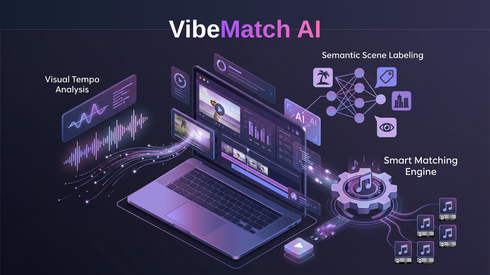

# 🎵 VibeMatch AI: Intelligent AI Soundtrack & Royalty-Free Music Generator



**Live Demo**: [https://vibematch-ai.streamlit.app/](https://vibematch-ai.streamlit.app/)

+ **VibeMatch AI** is an intelligent **AI soundtrack generator** and **royalty-free music generator** alternative for content creators. It automatically analyzes video visual energy, mood, and scene semantics to select 100% free CC0 and Public Domain background music using CLIP and the Freesound APIv2—ensuring your videos are always monetization-safe.

---

## ✨ Key Features

- 🎬 **Visual Tempo Analysis**: Uses SSIM (Structural Similarity) and Optical Flow to determine the "energy" and required BPM.
- 🏷️ **Semantic Scene Labeling**: Leverages CLIP-ViT-B-32 to identify video categories and vibes.
- 🌓 **Mood Detection**: Analyzes lighting, color palette, and saturation to infer the emotional state.
- 🎼 **Smart Matching Engine**: A 5-factor scoring system (BPM, Semantics, Mood, License, Duration).
- 🔊 **Live Freesound Integration**: Fetches real-time candidates from the Freesound API (v2).
- 🛡️ **Zero-Strike Policy**: Enforces metadata guardrails to ensure 100% legal safety for monetization.

---

## 🚀 Quick Start

### 1. Prerequisites
Ensure you have Python 3.9+ installed. We recommend using a virtual environment.

### 2. Installation
```bash
# Clone the repository
git clone https://github.com/peiyan0/vibematch-ai.git
cd vibematch-ai

# Install dependencies
pip install -r requirements.txt
```

### 3. API Configuration
Create a `.env` file in the root directory and add your Freesound API key:
```env
FREESOUND_API_KEY=your_key_here
```
*Get your key at: [freesound.org/apiv2/apply](https://freesound.org/apiv2/apply)*

### 4. Run the Dashboard
```bash
streamlit run app.py
```

---

## 🧠 Project Philosophy: Why Selection Beats Traditional AI Music Generators

While synthetic **AI music generation** tools are popular, they carry significant legal risks regarding training data, copyrights, and commercial rights. **VibeMatch AI** takes a different approach: it acts as a **smart selection soundtrack generator**.

1. **Copyright Safety**: Most AI music generators expose you to copyright strikes. Sourcing from **CC0 and Public Domain** ensures your videos are 100% safe for monetization.
2. **Zero Cost**: No subscription traps or "10 downloads per month" limits common to standard background music generators.
3. **Human Artistry**: Instead of repetitive synthetic loops produced by an algorithm, our generator matches you with professional tracks recorded by human musicians.

---

## 🔬 Technical Methodology

### The Matching Engine
The "Brain" of VibeMatch AI uses a weighted matching equation to rank candidates:

$$Match Score = (S_{visual} \cdot W_{genre}) + (E_{motion} \cdot W_{tempo}) + M_{mood}$$

- **$S_{visual}$**: Semantic similarity (Jaccard) between CLIP-identified keywords and track tags.
- **$E_{motion}$**: Gaussian correlation between visual motion energy and track BPM.
- **$M_{mood}$**: Compatibility bonus for aligned emotional profiles.

### Feature Extraction
- **Visual Tempo**: We calculate the **Structural Similarity Index (SSIM)** between sequential frames. A low SSIM indicates high motion or frequent cuts, signaling a need for higher BPM music.
- **Semantic Vibe**: We use **Zero-Shot CLIP Classification** to map video scenes (e.g., "travel vlog in Bali") directly to musical styles (e.g., "Acoustic", "World", "Tropical").

---

## 🏗️ Repository Structure

```text
.
├── assets/             # Static assets
├── docs/               # Detailed documentation
├── src/                # Core logic
│   ├── analyzer.py     # Video processing (OpenCV + CLIP)
│   ├── matcher.py      # Multi-factor scoring engine
│   └── music_fetcher.py # Live API fetching logic
├── tests/              # Smoke tests and validation scripts
├── app.py              # Main Streamlit application
├── requirements.txt    # Project dependencies
└── README.md           # You are here
```

---

## 🛠️ Technology Stack

- **Frontend**: Streamlit
- **ML Models**: CLIP (OpenAI), Sentence Transformers
- **Computer Vision**: OpenCV, scikit-image
- **API**: Freesound API v2
- **Agentic Standard**: WebMCP (Web Model Context Protocol) for Wave 3 AI agents
- **Data**: Freesound CC0/CC-BY Repository

---

## 🤖 WebMCP & Agentic Search Optimization (ASO)

VibeMatch AI is optimized for the **third wave of AI-driven traffic**—autonomous browsing agents. 

We publish a WebMCP actions discoverability manifest at [mcp-actions.json](mcp-actions.json) and support dynamic browser agent integrations:
- **Declarative Actions**: Declaratively exposes the soundtrack generation action using standard semantic markup elements.
- **Imperative Actions**: Registers the `generate-soundtrack` capability dynamically in compatible user agent execution frames via `window.parent.navigator.mcpActions.register()`.

This allows browsing agents (e.g., Claude in Chrome, Edge Copilot) to discover, initialize, and direct users seamlessly to complete video music matching tasks.

---

## 📄 License

This project is licensed under the MIT License - see the [LICENSE](LICENSE) file for details.
*Music fetched via Freesound is subject to its original CC0 or CC-BY licenses.*

---

*Built with ❤️ for creators*
